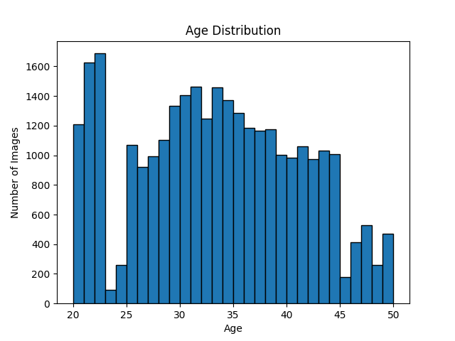
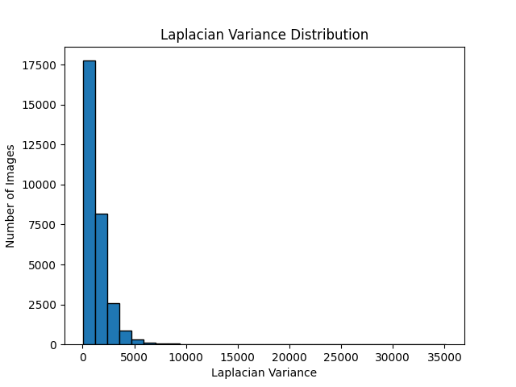
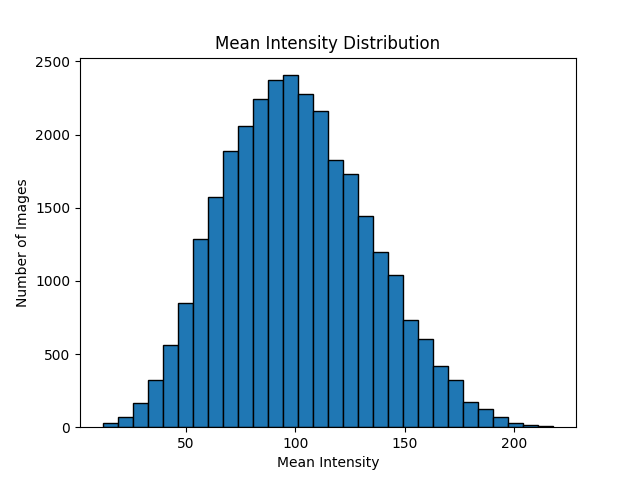
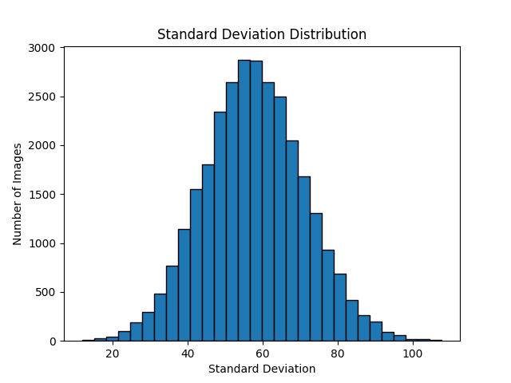
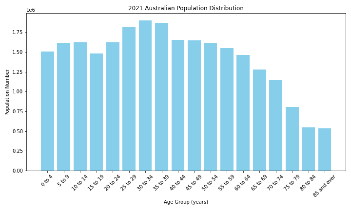
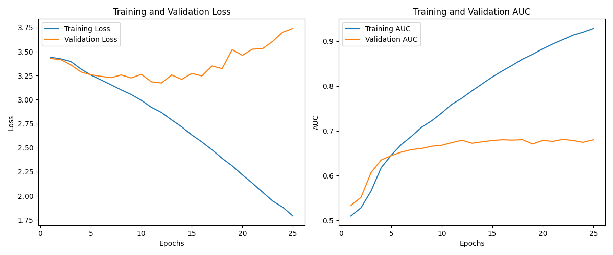

# Project Overview

This project involves developing a robust image processing and machine learning pipeline for age classification using a dataset of face images. The system design includes several scripts and configurations to handle data loading, preprocessing, quality checking, augmentation, visualization, and model training. The key components and their functionalities are described below.

##  System Design

- `utils.py`: Contains utility functions that are commonly used across multiple scripts.

- `explore_images.py`: Main script for loading the dataset, computing image quality metrics, checking image quality, and generating a CSV file with metadata.

- `image_reader.py`: Provides functions to load images, compute image quality metrics, and check image quality based on predefined thresholds.

- `image_processor.py`: Includes functions for processing images, such as sharpening, denoising, brightening, and enhancing texture. Also contains functions to ensure the processed images meet quality standards.

- `process_images.py`: Script to apply image processing functions to the dataset and save the processed images.

- `image_visualizer.py`: Provides functions for visualizing distributions of image quality metrics and saving the visualizations.

- `visualize_image_information.py`: Main script to visualize image quality metrics using the functions in `image_visualizer.py`. Generates plots for various metrics and saves them to specified directories.

- `australian_population.ipynb`: Jupyter notebook for analyzing Australian population distribution. Used to create a target distribution for resampling the dataset to match age demographics.

- `resampling.ipynb`: Jupyter notebook for resampling the dataset based on the target age distribution. Performs both up-sampling and down-sampling to achieve the desired distribution.

- `train_model.py`: Script to train a deep learning model for age classification. Includes data loading, model definition, training loop, and evaluation metrics.

### Configuration Files

The configuration files are stored in the configs directory. They specify various parameters for different scripts, such as paths to datasets, thresholds for quality metrics, and settings for data augmentation and model training.
Directories

- csv: Contains CSV files with metadata generated by explore_images.py.

- processed_dataset: Directory where processed images are saved after applying image quality checks and enhancements.

- resampled_dataset: Directory where resampled images are saved to match the target age distribution.

### Detailed Component Descriptions

#### `utils.py`

- Contains utility functions for tasks such as reading configuration files, logging, and common data processing steps.

#### `explore_images.py`

- Reads a configuration file for parameters.
- Loads images from the dataset directory.
- Computes image quality metrics such as blurriness, noise, brightness, and resolution.
- Checks the quality of images based on defined thresholds.
- Generates a CSV file with metadata for all images.

#### `image_reader.py`

- load_dataset: Loads images and their corresponding age labels.
- compute_images_quality_metrics: Computes quality metrics for each image.
- check_images_quality: Checks image quality and flags low-quality images.

#### `image_processor.py`

- Functions to process images (e.g., sharpening, denoising, brightening).
- Ensures processed images meet quality standards.

#### `process_images.py`

- Applies image processing functions to the dataset.
- Saves processed images to the processed_dataset directory.

#### `image_visualizer.py`

- visualize_distribution: Creates histograms for various image quality metrics and saves the plots.

#### `visualize_image_information.py`

- Uses `image_visualizer.py` functions to generate and save plots for image quality metrics.
- Reads metadata from a CSV file and creates visualizations.

#### `australian_population.ipynb`

- Analyzes Australian population distribution to create a target age distribution for resampling the dataset.

#### `resampling.ipynb`

- Performs resampling of the dataset to match the target age distribution.
- Uses both up-sampling (data augmentation) and down-sampling techniques.

#### `train_model.py`

- Loads the dataset and splits it into training and validation sets.
- Defines the age classification model.
- Trains the model and evaluates its performance.
- Saves the trained model.

## Data Analysis

### 1. Age Distribution

This histogram represents the distribution of images across different ages. Here's an explanation of the key points:

- X-axis (Age): The x-axis shows the age groups, ranging from 20 to 50 years.
- Y-axis (Number of Images): The y-axis shows the number of images corresponding to each age group.
- Insight: This histogram shows the distribution of the number of images across different age groups in the dataset. The dataset includes images labeled with ages ranging from 20 to 50. There is a noticeable peak around the age of 25 and a lower count of images in the higher age ranges like 45-50.

### 2. Laplacian Variance Distribution

- X-axis: Laplacian Variance
- Y-axis: Number of Images
- Insight: This histogram shows the distribution of the Laplacian variance values, which measure the sharpness of the images. A low variance indicates a blurry image. Most images have a low Laplacian variance, suggesting that there are many blurry images in the dataset.

### 3. Mean Intensity Distribution

- X-axis: Mean Intensity
- Y-axis: Number of Images
- Insight: This histogram shows the distribution of the mean intensity values of the images. The mean intensity is a measure of the overall brightness of an image. Most images have a mean intensity between 50 and 150, suggesting that the dataset contains images with a wide range of lighting conditions.

### 4. Standard Deviation Distribution

- X-axis: Standard Deviation
- Y-axis: Number of Images
- Insight: This histogram shows the distribution of the standard deviation of pixel intensities in the images. The standard deviation is a measure of the noise or texture in an image. Most images have a standard deviation between 40 and 80, indicating moderate noise levels.

### Image Quality Metrics

#### 1. Blurry Images

Blurriness can be quantified using the variance of the Laplacian. The Laplacian operator highlights regions of rapid intensity change, and its variance is a measure of how much the intensity changes in the image.

**Mathematical Definition:**
- **Laplacian:** The Laplacian is a second-order derivative operator that computes the sum of second-order derivatives in both the x and y directions.
- **Variance of the Laplacian:** The variance of the Laplacian measures the spread of pixel intensity values after applying the Laplacian operator. Lower variance indicates less sharpness (i.e., more blurriness).

#### 2. Noisy Images

Noise in images can be quantified using the standard deviation of pixel intensity values. High noise levels usually lead to higher standard deviation due to the random fluctuations in pixel values.

**Mathematical Definition:**
- **Standard Deviation:** Measures the amount of variation or dispersion of a set of values. Higher standard deviation indicates higher noise.

#### 3. Low Resolution

The number of pixels in the horizontal and vertical dimensions of the image.

#### 4. Poor Lighting

Poor lighting can be quantified using the mean intensity of the image. Images that are too dark or too bright will have mean intensity values close to 0 or 255, respectively.

**Thresholds for Image Quality Metrics:**
- **Laplacian Variance (Blurriness):**
  - Too Low: $< 100$ (indicates significant blurriness)
  - Too High: $> 1000$ (generally not an issue unless excessively high due to noise)
- **Mean Intensity (Brightness):**
  - Too Low: $< 50$ (indicates the image is too dark)
  - Too High: $> 200$ (indicates the image is too bright)
- **Standard Deviation (Noise):**
  - Too Low: $< 10$ (indicates lack of texture or overly smooth images)
  - Too High: $> 100$ (indicates significant noise)
- **Resolution:**
  - Typically, images with resolution less than a certain threshold (e.g., $100 \times 100$ pixels) are considered low resolution.
## Image Processing

### 1. Too Blurry

Technique: Sharpening

- Unsharp Masking: Enhances the edges in the image by subtracting a blurred version of the image from the original image.
- High-Pass Filtering: Emphasizes high-frequency components (edges) in the image.

### 2. Too Noisy (High Laplacian Variance or High Standard Deviation)

Technique: Denoising

- Gaussian Blur: Reduces image noise and detail by applying a Gaussian filter.
- Median Filtering: Reduces salt-and-pepper noise by replacing each pixel with the median value in its neighborhood.
- Bilateral Filtering: Reduces noise while preserving edges.
    
### 3. Too Dark & Too Bright

Technique: Brightness Adjustment

- Histogram Equalization: Enhances the contrast of images by spreading out the most frequent intensity values.
- Gamma Correction: Adjusts the brightness by applying a gamma value to the pixel values.
    
    
### 4. Lack of Texture

Technique: Texture Enhancement

- High-Pass Filtering: Enhances textures and edges by removing low-frequency components.
- Histogram Equalization: Enhances the contrast and can bring out textures.
    
### 5. Low Resolution

Technique: Super-Resolution

- Super-Resolution Techniques: Enhance the resolution of an image using machine learning models or interpolation methods.
- Interpolation: Methods like bilinear or bicubic interpolation to increase image size.

## Resampling

The resampling process is a crucial part of ensuring that the dataset used for training machine learning models is balanced and representative of the target population distribution. The goal is to modify the dataset to match the desired distribution, which can help improve the model's performance and generalizability.

### 1. Analyze the Target Distribution:
- The target distribution, such as the 2021 Australian population distribution, provides the basis for how the dataset should be resampled.
- This distribution is used to calculate the required number of images for each age group to ensure the dataset is balanced.

### 2. Calculate Required Images:
- The number of required images for each age group is calculated based on the target distribution.
- For example, if the dataset contains 20,000 images and the target distribution indicates that 7.1% of the population is aged 25 to 29, then approximately 1,420 images should represent this age group.

### 3. Assess Current Distribution:
- The current distribution of images across age groups is analyzed to determine the number of images currently available for each group.
- This analysis helps identify any imbalances in the dataset.

### 4. Determine Image Difference:
- The difference between the required number of images and the current number of images is calculated for each age group.
- Positive values indicate the need for more images (up-sampling), while negative values indicate an excess of images (down-sampling).

### 5. Perform Up-sampling and Down-sampling:
- Up-sampling: For age groups with fewer images than required, additional images are generated using data augmentation techniques. These techniques may include rotation, flipping, and color adjustment to create new, unique images from the existing ones.
- Down-sampling: For age groups with more images than required, a random selection of images is removed to reduce the number to the desired level.

### 6. Validate Resampling:
- After the resampling process, the new distribution of images is validated against the target distribution to ensure the resampling process has achieved the desired balance.

## Model Development & Training and Evaluation

The train_model.py script is designed to train a deep learning model for age classification using the SqueezeNet architecture. This script preprocesses the data, defines the model, trains it, and evaluates its performance using metrics like loss and AUC (Area Under the Curve).

### Data Preparation

The data preparation involves:

#### 1. Defining a Custom Dataset:
- The AgeDataset class is used to load images from the resampled_dataset directory.
- Images are labeled based on their subdirectory names, which correspond to the age group.

#### 2. Applying Transformations:
- Images are resized to 128x128 pixels.
- Images are normalized using the mean and standard deviation of the ImageNet dataset.

#### 3. Creating Data Loaders:
- The dataset is split into training and validation sets (80% training, 20% validation).
- Data loaders are created for both sets to facilitate batch processing during training.

### Model Definition

The AgeClassifier class defines the model architecture using the SqueezeNet model:

- The final classification layer of SqueezeNet is replaced with a convolutional layer to output 31 classes, corresponding to ages 20 to 50.
- The model is chosen specifically because its number of parameters does not exceed 1 million, making it suitable for deployment on edge devices.

### Training Process

The training process involves:

#### 1. Defining Loss Function and Optimizer:
- The CrossEntropyLoss function is used as the loss criterion.
- The Adam optimizer is used for parameter updates.

#### 2. Training Loop:
- The model is trained for a specified number of epochs.
- For each epoch, the model goes through a training phase and a validation phase.
- Metrics such as loss and AUC are calculated and stored for each epoch.

#### 3. Saving the Best Model:
- The model weights that yield the best validation AUC are saved.

#### 4. Parameter Count Check:
- The script checks the number of parameters in the model and ensures it does not exceed 1 million. This is critical for deployment on edge devices where resources are limited.

### Performance Visualization

The script generates visualizations for the training and validation metrics:

#### 1. Training and Validation Loss:
- The left plot in the figure shows the training and validation loss over the epochs.
- The training loss decreases steadily, indicating that the model is learning from the data.
- The validation loss, however, shows some fluctuations and starts to increase slightly after a few epochs, suggesting potential overfitting.

#### 2. Training and Validation AUC:
- The right plot in the figure shows the training and validation AUC over the epochs.
- The training AUC increases consistently, indicating improving model performance on the training set.
- The validation AUC increases initially but then fluctuates, which again might suggest overfitting or variability in validation performance.

### Conclusion

The model achieved the best validation AUC as indicated in the training logs. The generated plots provide a clear view of the model's learning process and highlight areas where improvements can be made, such as addressing potential overfitting.

## Model Packaging for C++ Deployment

To hand over the trained age prediction model to a C++ developer for seamless integration into a C++ pipeline, follow these steps:

### 1. Export the Trained Model:
- Save the trained PyTorch model using the torch.save() function. This creates a .pth file containing the model's state_dict (weights and biases).

### 2. Convert the Model to ONNX Format:
- Convert the saved PyTorch model to ONNX (Open Neural Network Exchange) format using the torch.onnx.export() function. ONNX is a widely supported format for machine learning models, making it easier to integrate into various platforms, including C++.

### 3. Prepare Preprocessing Scripts:
- Create a Python script for image preprocessing and normalization. This script should include all the steps necessary to prepare input images for the model, such as resizing, normalization, and any other required transformations.

### 4. Package the Model and Scripts:
- Package the ONNX model file and the preprocessing scripts together. Ensure that all necessary dependencies are included and that the C++ developer has clear instructions on how to use these files.

### 5. Provide Usage Instructions:
- Write detailed instructions for the C++ developer, explaining how to load the ONNX model and use the preprocessing scripts. Include information on the expected input format and any required dependencies or environment setup.

### 6. Integrate with C++ Pipeline:
- Instruct the C++ developer to use an ONNX runtime (such as ONNX Runtime or TensorRT) to load and run the model. The preprocessing script can be used to prepare the images before passing them to the model for inference.

## Steps for Using the Packaged Model in C++

### 1. Load the ONNX Model:
- Use an ONNX runtime library to load the ONNX model file. This will involve initializing the runtime and loading the model into memory.

### 2. Preprocess Input Images:
- Use the provided Python preprocessing script to prepare input images. This script should handle tasks like resizing, normalization, and any other required transformations.

### 3. Run Inference:
- Pass the preprocessed images to the ONNX model using the runtime library. Perform inference to obtain age predictions.

### 4. Post-process Predictions:
- Convert the model's output to meaningful age predictions. This may involve mapping the model's output to specific age groups.

### 5. Integrate into C++ Application:
- Integrate the entire process into the existing C++ pipeline, ensuring that the image preprocessing, model inference, and post-processing steps are all correctly implemented.

## Future Work
### Potential Improvements to the Model

#### 1. Model Architecture Enhancements:
- Explore more advanced or efficient model architectures such as EfficientNet or MobileNetV3. These architectures may offer better performance or reduced computational requirements, which is crucial for deployment on edge devices.

#### 2. Hyperparameter Optimization:
- Conduct extensive hyperparameter tuning to optimize the learning rate, batch size, and other parameters. Techniques such as grid search or Bayesian optimization can be employed to find the best combination of hyperparameters.

#### 3. Transfer Learning:
- Utilize pre-trained models on larger datasets and fine-tune them on the age prediction dataset. Transfer learning can significantly improve model performance, especially with limited data.

#### 4. Model Quantization:
- Apply model quantization techniques to reduce the model size and increase inference speed on edge devices. Quantization-aware training can help in maintaining model accuracy while reducing computational requirements.

### Potential Improvements to the Pipeline

#### 1. Automated Data Pipeline:
- Develop an automated pipeline for data preprocessing, augmentation, and quality assessment. This would streamline the data preparation process and ensure consistent data quality.

#### 2. Real-time Inference:
- Optimize the pipeline for real-time inference, enabling the model to make predictions with minimal latency. This is particularly important for applications where timely predictions are critical.

#### 3. Scalability:
- Enhance the scalability of the pipeline to handle larger datasets and more complex models. Implementing distributed computing techniques and leveraging cloud resources can help achieve this.

#### 4. Robust Error Handling:
- Implement robust error handling and logging mechanisms throughout the pipeline. This would ensure that any issues are promptly identified and addressed, improving the overall reliability of the system.

#### 5. Continuous Monitoring and Evaluation:
- Set up a continuous monitoring and evaluation framework to track the model's performance over time. This would help in identifying any degradation in performance and facilitate timely updates to the model.

#### 6. Integration with C++:
- Provide comprehensive documentation and support for integrating the model with C++ applications. This would make it easier for developers to deploy the model in production environments.

#### 7. Security Enhancements:
- Implement security measures to protect the model and data. This includes encryption of sensitive data, secure model deployment, and access control mechanisms.
